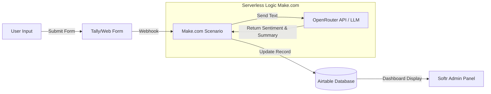
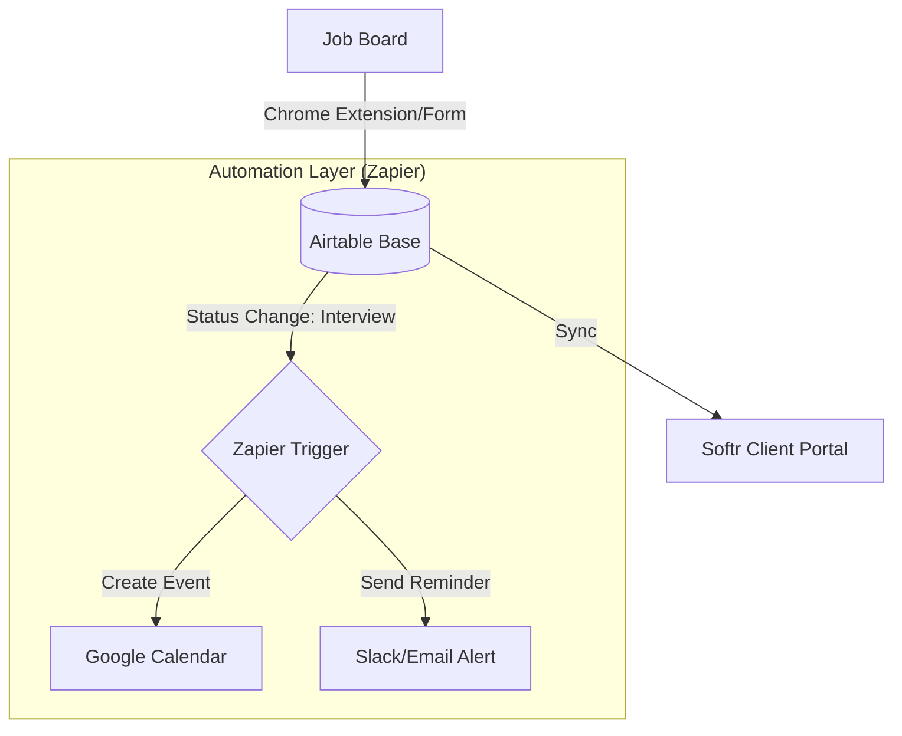
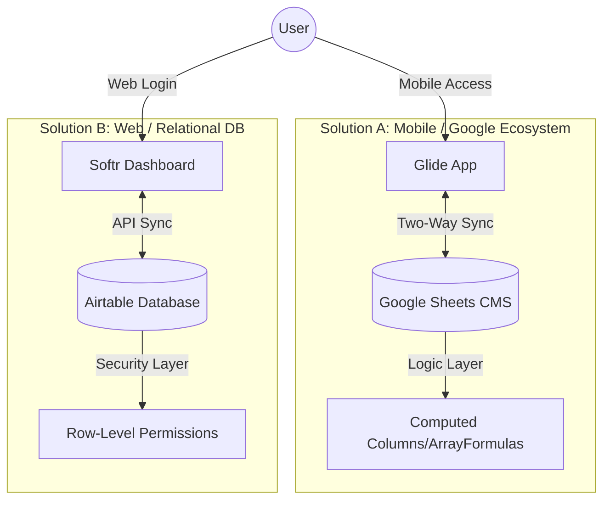

# no-code-business-automation
This repository documents a series of automated business applications designed to solve operational inefficiencies. By leveraging No-Code platforms and API integrations, I reduced development time by 80% while maintaining robust data integrity and user experience.

# ⚡ No-Code & Business Process Automation Portfolio

**Status:** Production-Ready Workflows
**Tools:** Airtable, Zapier, Make.com, Softr, OpenRouter API, Glide

## 📖 Portfolio Overview
This repository documents a series of automated business applications designed to solve operational inefficiencies. By leveraging No-Code platforms and API integrations, I reduced development time by 80% while maintaining robust data integrity and user experience.

---

## 🤖 Project 1: AI-Powered Feedback Collector
**Goal:** Automate the analysis of user feedback using Generative AI without maintaining a dedicated backend server.

### 🏗️ Integration Architecture
The system follows a serverless "Webhook" pattern to trigger AI processing instantly upon data entry.

##🧠 Key Implementation Details
###API Orchestration: Configured Make.com (formerly Integromat) to handle JSON payloads between the frontend and the OpenRouter API.

###Prompt Engineering: Designed specific system prompts to ensure the AI returns structured JSON data (Sentiment Score, Category, Summary) rather than unstructured text, ensuring clean database entry.

## 🤖 Project 2:Automated Job Application Tracker
**Goal:** Streamline the job hunt process by centralizing applications and automating follow-up reminders.

###🏗️ Automation Workflow
A multi-stage pipeline that eliminates manual status tracking.

###🧠 Key Implementation Details
##Relational Data Modeling: Designed the Airtable base with linked records connecting Companies ↔ Applications ↔ Interviews, ensuring a normalized data structure.

##Conditional Logic: Implemented Zapier paths to trigger different actions based on application status (e.g., "Rejected" archives the row, "Offer" triggers a high-priority alert).

## 💰 Project 3: Omni-Channel Expense Trackers
**Goal:** Create accessible financial tracking tools for both web and mobile users without complex native development.

###📱 Solution A: Mobile-First (Glide + Google Sheets)
##Tech Stack: Glide Apps, Google Sheets.

##Architecture: Utilized Google Sheets as a headless CMS. Configured Glide’s "Computed Columns" to calculate rolling balances and category totals on the device, reducing latency.

###💻 Solution B: Web Portal (Softr + Airtable)
##Tech Stack: Softr, Airtable.

##Features:

##Role-Based Security: Configured granular permissions so users can only view their own expense rows (Row-Level Security).

##Dashboarding: Built summary charts directly in Softr to visualize spending trends month-over-month.

###🚀 Impact Summary
##Speed to Market: Delivered fully functional CRUD applications in under 48 hours per project.

##Cost Efficiency: Replaced potential SaaS subscriptions ($100+/mo) with custom-built, low-cost tools.

##Scalability: The Airtable backends are designed to handle 50k+ records, sufficient for SMB (Small/Medium Business) operations.

